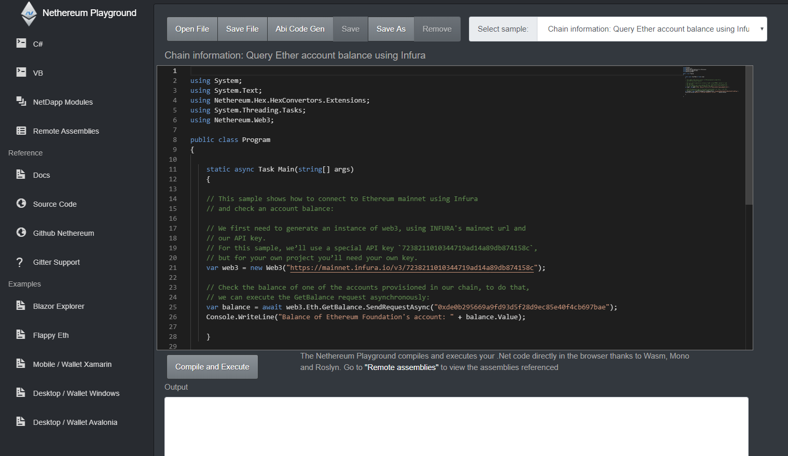

# Nethereum

Nethereum is the Ethereum .Net integration platform, the aim is to provide solutions to develop any type of dapp (web, mobile, desktop), backend integration or gaming and VR using platforms like Unity3d.

## Nethereum core
The main Nethereum Solution and projects: Source and more Info: [https://github.com/Nethereum/Nethereum](https://github.com/Nethereum/Nethereum)

### Main Libraries

|  Project Source | Nuget_Package |  Description |
| ------------- |--------------------------|-----------|
| [Nethereum.Web3](https://github.com/Nethereum/Nethereum/tree/master/src/Nethereum.Web3)    | [](https://badge.fury.io/nu/nethereum.web3)| Ethereum Web3 Class Library to simplify the interaction with Ethereum (RPC, Contracts, Signing, etc) |
| [Nethereum.Unity](https://github.com/Nethereum/Nethereum/tree/master/src/Nethereum.Unity) |  | Unity3d integration, libraries can be found in the Nethereum [releases](https://github.com/Nethereum/Nethereum/releases) |

## Core Libraries

|  Project Source | Nuget_Package |  Description |
| ------------- |--------------------------|-----------|
| [Nethereum.ABI](https://github.com/Nethereum/Nethereum/tree/master/src/Nethereum.ABI) | [](https://badge.fury.io/nu/nethereum.abi)| Encoding and decoding of ABI Types, functions, events of Ethereum contracts |
| [Nethereum.Hex](https://github.com/Nethereum/Nethereum/tree/master/src/Nethereum.Hex) | [](https://badge.fury.io/nu/nethereum.hex)| HexTypes for encoding and decoding String, BigInteger and different Hex helper functions|
| [Nethereum.RPC](https://github.com/Nethereum/Nethereum/tree/master/src/Nethereum.RPC)   | [](https://badge.fury.io/nu/nethereum.rpc) | Core RPC Class Library to interact via RCP with an Ethereum client |
| [Nethereum.Contracts](https://github.com/Nethereum/Nethereum/tree/master/src/Nethereum.Contracts)  | [](https://badge.fury.io/nu/nethereum.contracts) | Core library to interact via RPC with Smart contracts in Ethereum including presets for ERC20, ERC1155, ENS, ProofOfHumanity, MultiCall, etc|
| [Nethereum.JsonRpc.RpcClient](https://github.com/Nethereum/Nethereum/tree/master/src/Nethereum.JsonRpc.RpcClient)   | [](https://badge.fury.io/nu/nethereum.jsonrpc.rpcclient) | JsonRpc Rpc Client using Http|
| [Nethereum JsonRpc IpcClient](https://github.com/Nethereum/Nethereum/tree/master/src/Nethereum.JsonRpc.IpcClient)| [](https://badge.fury.io/nu/nethereum.jsonRpc.ipcclient) |JsonRpc IpcClient provider for Windows, Linux and Unix|
| [Nethereum.JsonRpc.WebSocketClient](https://github.com/Nethereum/Nethereum/tree/master/src/Nethereum.JsonRpc.WebSocketClient)| [](https://badge.fury.io/nu/Nethereum.JsonRpc.WebSocketClient) |JsonRpc WebsocketClient provider for Windows, Linux and Unix|
| [Nethereum.RLP](https://github.com/Nethereum/Nethereum/tree/master/src/Nethereum.RLP)  | [](https://badge.fury.io/nu/nethereum.rlp) | RLP encoding and decoding |
| [Nethereum.KeyStore](https://github.com/Nethereum/Nethereum/tree/master/src/Nethereum.KeyStore)  | [](https://badge.fury.io/nu/nethereum.keystore) | Keystore generation, encryption and decryption for Ethereum key files using the Web3 Secret Storage definition, https://github.com/ethereum/wiki/wiki/Web3-Secret-Storage-Definition |
| [Nethereum.Signer](https://github.com/Nethereum/Nethereum/tree/master/src/Nethereum.Signer)  | [](https://badge.fury.io/nu/nethereum.signer) | Nethereum signer library to sign and verify messages, RLP and transactions using an Ethereum account private key |
| [Nethereum.HDWallet](https://github.com/Nethereum/Nethereum/tree/master/src/Nethereum.HDWallet)  | [](https://badge.fury.io/nu/nethereum.HDWallet) | Generates an HD tree of Ethereum compatible addresses from a randomly generated seed phrase (using BIP32 and BIP39) |
| [Nethereum.Metamask.Blazor](https://github.com/Nethereum/Nethereum/tree/master/src/Nethereum.Metamask.Blazor)  | [](https://badge.fury.io/nu/Nethereum.Metamask.Blazor) | Metamask / Blazor integration |
| [Nethereum.BlockchainProcessing](https://github.com/Nethereum/Nethereum/tree/master/src/Nethereum.BlockchainProcessing)  | [](https://badge.fury.io/nu/Nethereum.BlockchainProcessing) |Nethereum Blockchain crawler and log processing |
| [Nethereum.GnosisSafe](https://github.com/Nethereum/Nethereum/tree/master/src/Nethereum.GnosisSafe)  | [](https://badge.fury.io/nu/Nethereum.GnosisSafe) |Nethereum GnosisSafe integration |
| [Nethereum.ENS](https://github.com/Nethereum/Nethereum/tree/master/src/Nethereum.ENS)  | [](https://badge.fury.io/nu/Nethereum.ENS) |Nethereum ENS extended integration |
| [Nethereum.ENS](https://github.com/Nethereum/Nethereum/tree/master/src/Nethereum.ENS)  | [](https://badge.fury.io/nu/Nethereum.ENS) |Nethereum ENS extended integration |
| [Nethereum.Signer.EIP712](https://github.com/Nethereum/Nethereum/tree/master/src/Nethereum.Signer.EIP712)  | [](https://badge.fury.io/nu/Nethereum.Signer.EIP712) |Nethereum EIP712|
| [Nethereum.Siwe](https://github.com/Nethereum/Nethereum/tree/master/src/Nethereum.Siwe)  | [](https://badge.fury.io/nu/Nethereum.Siwe) |Nethereum SIWE|

And others, check the source here: https://github.com/Nethereum/Nethereum/tree/master/src or Nugets https://www.nuget.org/profiles/nethereum

## Node / Client extension Libraries
| Project Source | NuGet Package | Description |
|----------------|----------------|-------------|
| [Nethereum.Geth](https://github.com/Nethereum/Nethereum/tree/master/src/Nethereum.Geth) | [](https://badge.fury.io/nu/nethereum.geth) | Extended Web3 library for Geth, including non-generic RPC API methods for Admin, Debug, Miner, etc. |
| [Nethereum.Quorum](https://github.com/Nethereum/Nethereum/tree/master/src/Nethereum.Quorum) | [](https://badge.fury.io/nu/nethereum.quorum) | Extension for Quorum, JP Morgan's permissioned Ethereum supporting private transactions. |
| [Nethereum.Besu](https://github.com/Nethereum/Nethereum/tree/master/src/Nethereum.Besu) | [](https://badge.fury.io/nu/nethereum.besu) | Extended Web3 library for Besu with non-generic RPC methods for interacting with Hyperledger Besu. |
| [Nethereum.Optimism](https://github.com/Nethereum/Nethereum/tree/master/src/Nethereum.Optimism) | [](https://badge.fury.io/nu/Nethereum.Optimism) | Nethereum integration for Optimism Layer 2 Ethereum scaling. |


## Nethereum Playground. Try Nethereum now in your browser.
The Nethereum playground http://playground.nethereum.com provides a simple IDE with many examples and first point of documentation on common tasks using Nethereum. Some of the examples included: 
Chain interation, Ether transfer, Transaction Signing, 1559 Fees, Interaction with Smart contracts and events, Smart contracts structs, Log and Blockchain Processing, Gnosis Safe, ENS, ERC20 and ERC721 presets, Hd Wallets, L2 Optimism, EIP712 Sign and recover a typed message, Abi Encoding, Key Store, Quorum, and many more...

[](http://playground.nethereum.com)

## Do you need support, want to have a chat, or want to help?
Please join the Discord server using this link: https://discord.gg/u3Ej2BReNn
We should be able to answer there any simple queries, general comments or requests, everyone is welcome.
If you want to help or have any ideas for a pull request just come and chat.

## Documentation
The documentation and guides can be found at [Read the docs](https://nethereum.readthedocs.io/en/latest/). 

## Examples and Templates
The simplest way to get started, is to use one of the provided examples or templates

### Nethereum.Templates.Pack
The nethereum templates pack includes templates to work and create smart contract libraries, standalone or using a contract framewowrk like Open Zeppelin.
It also includes Blazor wasm and server project templates that integrate with Metamask or Siwe (Sign with Ethereum)

#### Installation
Nuget: https://www.nuget.org/packages/Nethereum.Templates.Pack/

```dotnet new -i Nethereum.Templates.Pack```

#### Templates included

```
Template Name                                                  Short Name           Language  Tags
-------------------------------------------------------------  -------------------  --------  -----------------------------------------------------
Nethereum Default Smart contract Library / XUnit ERC20 sample  smartcontract        [C#]      Nethereum/Smart contracts
Nethereum ERC721, ERC1155 Open Zeppelin and  XUnit Projects    nethereum-erc721-oz  [C#]      Nethereum/Smart contracts/OpenZeppelin/ERC721/ERC1155
Nethereum Blazor Metamask Wasm-Server Projects                 nethereum-mm-blazor  [C#]      Nethereum/Blazor/Metamask
Nethereum Blazor SIWE Wasm/Server/RestApi Projects             nethereum-siwe       [C#]      Nethereum/SIWE/Blazor/Metamas/RestApi
Nethereum WebSocket Streaming Examples                         nethereum-ws-stream  [C#]      Nethereum/WebSocketStreaming
```
### Nethereum Default Smart contract Library / XUnit ERC20 sample
Source and more info: https://github.com/Nethereum/Nethereum.Templates.SmartContractDefault

Template to create a smart contract library development solution including:
* Smart contract example (ERC20)
* Auto code generation settings for vscode
* XUnit testing and testchains setup for Geth, Ganache, CustomUrl, etc
* Examples of integration testing the smart contract ERC20 (Token transfer, balance, deployment, Events and Log Processing)
* Examples of integration testing Ether transfers


### Nethereum ERC721, ERC1155 Open Zeppelin and  XUnit Projects 
Source and more info: https://github.com/Nethereum/Nethereum.Templates.SmartContracts.OZ-Erc721-Erc1155

Template to get started creating ERC721 NFTs - ERC1155 and DAO Governor using OpenZeppelin
For more information:

* ERC721 Spec https://eips.ethereum.org/EIPS/eip-721
* ERC1155 https://eips.ethereum.org/EIPS/eip-1155


### Nethereum Blazor Metamask Wasm-Server Projects
Source and more info: https://github.com/Nethereum/Nethereum.Templates.Metamask.Blazor

This projects provides the quick start example/template on how to integrate Metamask + Nethereum using Blazor interop. The project allows you to work both in Wasm and Server side, so you can create a fully decentralised application using Wasm or semi-decentralised using server hosted components (Web3+Web2).

Both project types include and example on how to:
+ Configure Metamask as a UI host provider
+ Connect to Metamask
+ Interact with Ethereum using simple Web3 rpc calls (Blockhash and ChainId)
+ How to create a generic component for ERC20 token transfer including simple validation using FluentValidation 
+ How to use the EthereumAuthenticationStateProvider and the claim role "EthereumConnected" with connected account
+ How to override the default styles of the Metmask component


### Nethereum Blazor SIWE Wasm/Server/RestApi Projects
Source and more info: https://github.com/Nethereum/Nethereum.Templates.Siwe

The Nethereum SIWE template provides an starting point of signing and authentication using Ethereum accounts and the standard SIWE message.
The templates provides the following use cases, and how SIWE can be implemented using the Nethereum libraries.
+ Rest Api 
+ Blazor Wasm + Rest Api
+ Blazor Server side (standalone)
+ Maui (Future template with Rest Api)
+ Avalonia (Future template with Rest Api)


## Wallets and End to End examples

### Blazor / Maui Hybrid Explorer wallet (Desktop, Mobile)
Source and more info: https://github.com/Nethereum/Nethereum-Explorer-Wallet-Template-Blazor

Nethereum Explorer is a .Net Blazor Wasm SPA, Desktop Windows and Mac, Android and iOS light blockchain explorer and simple wallet Template.

You can try it here: https://explorer.nethereum.com


### Desktop wallet (Avalonia)
Source and more info: https://github.com/Nethereum/Nethereum.UI.Desktop

Functional sample of a Reactive Cross platform desktop wallet connecting to Ethereum using Nethereum, Avalonia and ReactiveUI.

The aim of the starter kit is to provide a continous improving shell allowing to focus only on the developing the specific screens that provide the integration with smart contracts.

The main example for this is the Standard Token component which provides the desktop views and view models


## Unity 3D project

#### Unity package
Nethereum can be installed as a Unity Package using the following git repository:  https://github.com/Nethereum/Nethereum.Unity

#### Getting started (Unity3d Net472 / Netstandard Sample)
Source and more info: https://github.com/Nethereum/Unity3dSampleTemplate

* Output to the log the current BlockNumber using Unity.UI both in Async and coroutines
* Ether transfer using Web3 and coroutines
* Smart contract deployment (ERC20), Transactions (Transfer) and Querying (Balance)
* Using 1559 Suggestion strategies or Legacy mode when tranfering Ether
* Cross Platform architecture for both Coroutines and Task to enable the reuse of your code using different deployments Native /Desktop or Browser using Metamask)
* Metamask connectivity in browser
### Desktop demo

)
### Browser demo

)

#### Unity WebGl 
Source: https://github.com/Nethereum/Nethereum.Unity.Webgl

Example on how to integrate a WebGl unity project with Metamask, Deploy an ERC721 smartcontract (NFT) and interact with the smart contract minting a token and retrieving the asset (image) associated with it.


<!--

**Here are some ideas to get you started:**

🙋‍♀️ A short introduction - what is your organization all about?
🌈 Contribution guidelines - how can the community get involved?
👩‍💻 Useful resources - where can the community find your docs? Is there anything else the community should know?
🍿 Fun facts - what does your team eat for breakfast?
🧙 Remember, you can do mighty things with the power of [Markdown](https://docs.github.com/github/writing-on-github/getting-started-with-writing-and-formatting-on-github/basic-writing-and-formatting-syntax)
-->


